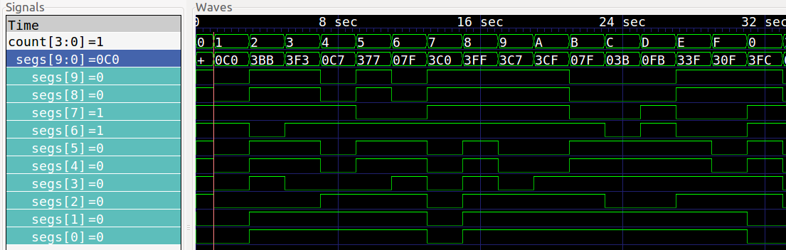
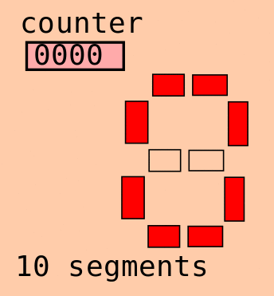

# Animate an SVG with a VCD

This is a tool for generating animations useful for teaching digital logic.

A VCD file is created by simulating a Verilog file  with iverilog and vvp.
Here's a [10 segment counter](https://github.com/mattvenn/icestick-multisegment/blob/master/seg10.v) counting from 0 to 15 as displayed by GTKWave:

An animated gif can be created from an [SVG template](10seg.svg) file and animated over a number of frames. 

# Instructions

Create the SVG file by drawing your picture in Inkscape or similar, and then setting each object you want to animate with a unique ID.

So far, the only animations supported are changing text and changing style (contributions welcome!)

Then create/modify the [configuration file](config.py). There are some helper functions to do some basic conversion and comparisons:

    # add the animators. The svg_id matches the ID in the SVG file, and the vcd_id is the name of the data in the VCD file
    animators.append(
        TextReplacer(svg_id='count', vcd_id='counter', conversion=convertBinStrToInt()))

    # 1 for each segment in the display
    for bit in range(10):
        animators.append(
            StyleReplacer(svg_id='seg%d' % bit, vcd_id='segs', replace=('fill:none', 'fill:red'), compare=compareBitField(bit)))

    # how many frames 
    frames = 16

    # files
    svg_file = "10seg.svg"
    vcd_file = "test.vcd"

Then run the animation and use ImageMagick's convert to convert to an animated gif:

	python animateVCD.py
	convert -delay 50 -morph 1 frames/*svg $@

# Acknowledgements

Thanks to Gene Sullivan, Sameer Gauria for [Verilog_VCD](https://pypi.org/project/Verilog_VCD/)
